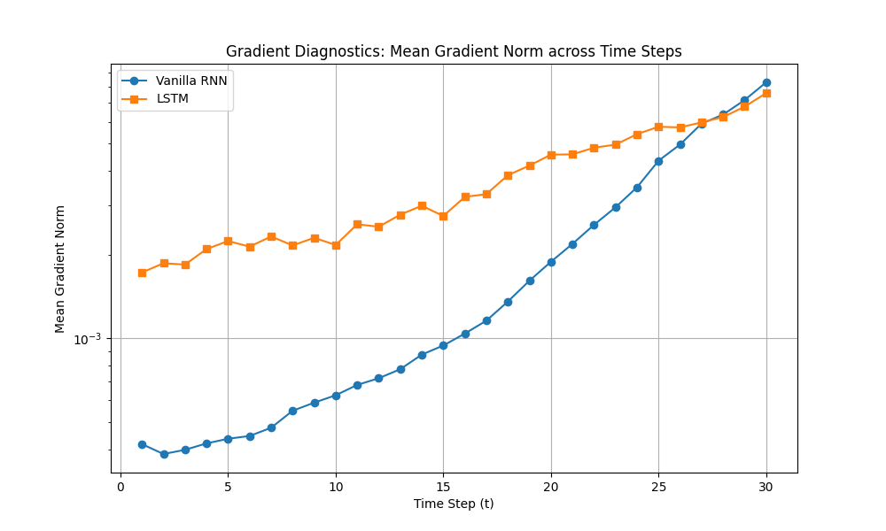

# Deep Recurrent Neural Networks: Empirical Analysis of Vanishing Gradients via BPTT

This repository offers a comprehensive PyTorch implementation and diagnostic investigation into Deep Recurrent Neural Networks (RNNs). The core focus is evaluating the vanishing and exploding gradient phenomena during Backpropagation Through Time (BPTT) by comparing a custom **Vanilla RNN** against a Long Short-Term Memory (**LSTM**) network on a sequence learning task.

---

## 1. Theoretical Background & Objectives
Training traditional recurrent architectures over long temporal dependencies is inherently challenging due to gradient instability. This project aims to:
* Implement an end-to-end text preprocessing and sequence padding pipeline from scratch.
* Build and benchmark custom sequence-to-vector models using **Vanilla RNN** and **LSTM** cells.
* Empirically track and analyze the norm of the hidden-to-hidden gradients across 30 distinct time steps ($t$) during the backward pass.
* Prove how the **Carousel Error Constant (CEC)** inside the LSTM cell structure mitigates the exponential decay of gradients compared to the multiplicative Jacobian chains in Vanilla RNNs.

---

## 2. Mathematical Formulation of the Gradient Problem

### Vanilla RNN Bottleneck
In a standard RNN, the hidden state update is defined as:
$$h_t = \tanh(W_{hh}h_{t-1} + W_{xh}x_t + b_h)$$

During BPTT, computing the gradient of the loss at step $T$ with respect to the hidden state at an early step $t$ involves a cumulative product of Jacobians:
$$\frac{\partial h_T}{\partial h_t} = \prod_{k=t+1}^{T} \frac{\partial h_k}{\partial h_{k-1}} = \prod_{k=t+1}^{T} \text{diag}(1 - \tanh^2(\cdot)) W_{hh}^T$$

If the largest singular value (spectral radius) of $W_{hh}$ is less than 1, or as the derivative of $\tanh$ bounds the values between $[0, 1]$, the gradient norm decays exponentially toward zero as $(T - t)$ increases, leading to a severe **Vanishing Gradient** problem.

### The LSTM Solution (CEC)
LSTM introduces the cell state ($c_t$) updated via an additive mechanism:
$$c_t = f_t \odot c_{t-1} + i_t \odot \tilde{c}_t$$

When taking the derivative, the error carousel allows the gradient to propagate back through time additively:
$$\frac{\partial c_t}{\partial c_{t-1}} = f_t + \text{terms involving derivatives of gates}$$

If the forget gate $f_t \approx 1$, the gradient flows backward indefinitely without exponential decay, preserving long-term temporal context.

---

## 3. Empirical Gradient Diagnostics

During training, the exact mean gradient norms were tracked across 30 backward steps. The empirical evaluation clearly validates the theoretical assumptions:

* **Vanilla RNN Behavior:** The gradient norm exhibits a sharp, continuous exponential decay. By the time the gradient reaches the earliest steps ($t=1$), its magnitude vanishes almost entirely, rendering the model incapable of updating early temporal weights based on late errors.
* **LSTM Behavior:** The gradient norm remains remarkably stable, highly uniform, and orders of magnitude larger across all 30 time steps. This highlights the architectural efficiency of the additive cell state in keeping the error carousel alive.

### Visualization
Below is the empirical diagnostic plot generated directly from the training loop, capturing the mean gradient norm across time steps for both architectures:



---

## Repository Structure
```text
├── RNN.ipynb                 # Full pipeline: Preprocessing, architectures, training loops, & tracking
├── gradient_diagnostics.png  # Saved comparative log-scale plot of gradient norms
└── README.md                 # Project documentation & theoretical synthesis
